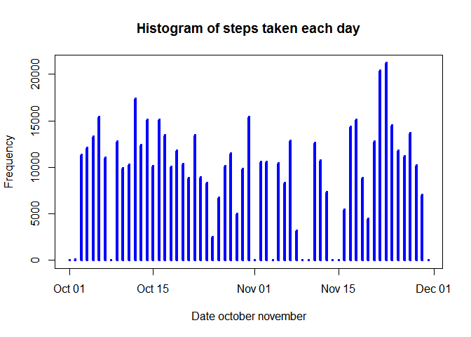
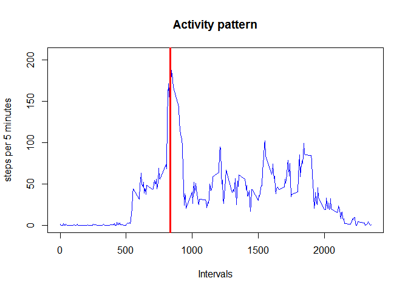
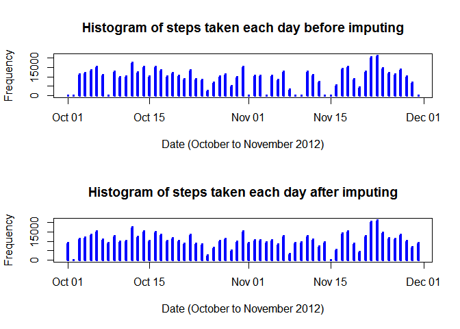
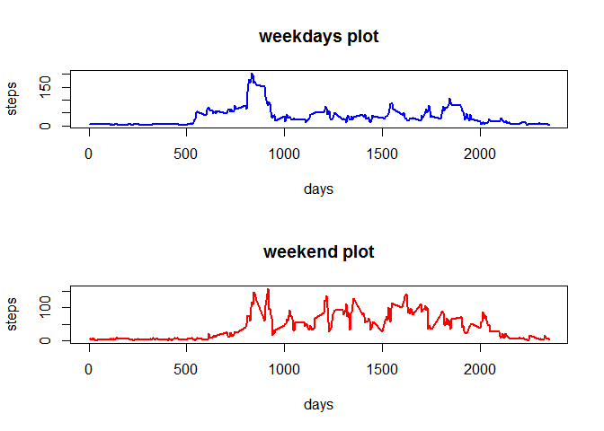

# Reproducible Research: Peer Assessment 1


### 1. Load data from csv file 
    

```r
        setwd("C:/Users/Admin/Desktop/coursera/programmingAssignment_RR1/RepData_PeerAssessment1/activity")
        stepData <- read.csv("activity.csv")
        summary(stepData)
```

```
##      steps                date          interval     
##  Min.   :  0.00   2012-10-01:  288   Min.   :   0.0  
##  1st Qu.:  0.00   2012-10-02:  288   1st Qu.: 588.8  
##  Median :  0.00   2012-10-03:  288   Median :1177.5  
##  Mean   : 37.38   2012-10-04:  288   Mean   :1177.5  
##  3rd Qu.: 12.00   2012-10-05:  288   3rd Qu.:1766.2  
##  Max.   :806.00   2012-10-06:  288   Max.   :2355.0  
##  NA's   :2304     (Other)   :15840
```

### 2. Process/transform data 
 

```r
        # Convert date from factor to type date
        stepData$date <- as.Date(stepData$date)
        #Get all the unique dates
        uniqueDates <- unique(stepData$date)
        #keep a list of intervals
        uniqueIntervals <- unique(stepData$interval)
```
        
#What is mean total of steps taken per day
### 1.Total number of steps per day         


```r
        #split the steps based on date
        stepsSplitPerDay <- split(stepData$steps, stepData$date)
        # sum of steps taken per day
        sumOfStepsPerDay <- sapply(stepsSplitPerDay, sum, na.rm = TRUE) 
        sumOfStepsPerDay
```

```
## 2012-10-01 2012-10-02 2012-10-03 2012-10-04 2012-10-05 2012-10-06 
##          0        126      11352      12116      13294      15420 
## 2012-10-07 2012-10-08 2012-10-09 2012-10-10 2012-10-11 2012-10-12 
##      11015          0      12811       9900      10304      17382 
## 2012-10-13 2012-10-14 2012-10-15 2012-10-16 2012-10-17 2012-10-18 
##      12426      15098      10139      15084      13452      10056 
## 2012-10-19 2012-10-20 2012-10-21 2012-10-22 2012-10-23 2012-10-24 
##      11829      10395       8821      13460       8918       8355 
## 2012-10-25 2012-10-26 2012-10-27 2012-10-28 2012-10-29 2012-10-30 
##       2492       6778      10119      11458       5018       9819 
## 2012-10-31 2012-11-01 2012-11-02 2012-11-03 2012-11-04 2012-11-05 
##      15414          0      10600      10571          0      10439 
## 2012-11-06 2012-11-07 2012-11-08 2012-11-09 2012-11-10 2012-11-11 
##       8334      12883       3219          0          0      12608 
## 2012-11-12 2012-11-13 2012-11-14 2012-11-15 2012-11-16 2012-11-17 
##      10765       7336          0         41       5441      14339 
## 2012-11-18 2012-11-19 2012-11-20 2012-11-21 2012-11-22 2012-11-23 
##      15110       8841       4472      12787      20427      21194 
## 2012-11-24 2012-11-25 2012-11-26 2012-11-27 2012-11-28 2012-11-29 
##      14478      11834      11162      13646      10183       7047 
## 2012-11-30 
##          0
```
### 2. Histogram of total steps per day


```r
        plot(uniqueDates, sumOfStepsPerDay, 
             main = "Histogram of steps taken each day", 
             xlab = "Date october november", 
             ylab = "Frequency", 
             type = "h", lwd = 4, col = "blue")
```

<!-- -->
### 3. Mean steps per day       


```r
        meanOfStepsPerDay <- sapply(stepsSplitPerDay, mean, na.rm = TRUE)
        meanDataFrame <- data.frame(uniqueDates, meanOfStepsPerDay, row.names = NULL)
        head(meanDataFrame)
```

```
##   uniqueDates meanOfStepsPerDay
## 1  2012-10-01               NaN
## 2  2012-10-02           0.43750
## 3  2012-10-03          39.41667
## 4  2012-10-04          42.06944
## 5  2012-10-05          46.15972
## 6  2012-10-06          53.54167
```
### 4. Median steps per day


```r
        medianStepsPerDay <- sapply(stepsSplitPerDay, median, na.rm = TRUE)
        medianDataFrame <- data.frame(uniqueDates,medianStepsPerDay, row.names = NULL)
        head(medianDataFrame)
```

```
##   uniqueDates medianStepsPerDay
## 1  2012-10-01                NA
## 2  2012-10-02                 0
## 3  2012-10-03                 0
## 4  2012-10-04                 0
## 5  2012-10-05                 0
## 6  2012-10-06                 0
```
## Average daily acitivity pattern


```r
        intervalSplit <- split(stepData$steps, stepData$interval)  
        averageStepsPerInterval <- sapply(intervalSplit, mean, na.rm = TRUE)
        plot(uniqueIntervals, averageStepsPerInterval, main = "Activity pattern",
                        xlab = "Intervals", ylab = "steps per 5 minutes",
                        type = "l",col = "blue")
        
        
        maxIntervalDays <- max(averageStepsPerInterval, na.rm = TRUE)
        maxIndex <- as.numeric(which(averageStepsPerInterval == maxIntervalDays))
        
        maxInterval <- uniqueIntervals[maxIndex]
        abline(v=maxInterval, col="red", lwd=3)
```

<!-- -->


## Imputing missing data values

### 1. Total number of missing values


```r
        isna <- is.na(stepData$steps)
        sum(isna)
```

```
## [1] 2304
```
### 2 Filling the missing values         


```r
         meanOfStepsPerDay[is.nan(meanOfStepsPerDay)] <- 0
         meanColumn <- rep(meanOfStepsPerDay, 288)
         rawSteps <- stepData$steps
         stepsNA <- is.na(rawSteps)
         rawSteps[stepsNA] <- meanColumn[stepsNA]
```
### 3. Create a new data set with NAs replaced by mean values


```r
        datNew <- stepData
        datNew$steps <- rawSteps
        #datNew
        
        stepsSplitNew <- split(datNew$steps, stepData$date)
        
        totalStepsPerDayNew <- sapply(stepsSplitNew, sum)
```
### 4 Plot histogram for the new data and data with NAs


```r
        par(mfcol=c(2,1))
        # Plot the original histogram first
        plot(uniqueDates, sumOfStepsPerDay, main="Histogram of steps taken each day before imputing", 
                xlab="Date (October to November 2012)", ylab="Frequency", type="h", lwd=4, col="blue")
        # Plot the modified histogram after
        plot(uniqueDates, totalStepsPerDayNew, main="Histogram of steps taken each day after imputing", 
                xlab="Date (October to November 2012)", ylab="Frequency", type="h", lwd=4, col="blue")        
```

<!-- -->
### Create a new factor variable in the steps data.


```r
        dates <- strptime(datNew$date,"%Y-%m-%d")
        wday <- dates$wday
        
        #classify the date as weekend or weekdays
        classifydays <- rep(0, length(wday)-1)
        
        #Fill classifydays with 1 if the date is a weekday
        classifydays[wday >= 1 & wday <=5] <- 1
        #Fill  classifydays with 2 if the date is a weekend
        classifydays[wday == 6 | wday == 0] <- 2
        
        #create a factor variable to our data set
        factorData <- factor(classifydays, levels = c(1,2), labels = c("Weekday", "Weekend"))
        
        datNew$dayOfWeek <- factorData 
        
        
        #split into weekdays and weekends
        daysweekday <- datNew[datNew$dayOfWeek == "Weekday",]
        daysweekend <- datNew[datNew$dayOfWeek == "Weekend",]
        
        head(datNew)
```

```
##      steps       date interval dayOfWeek
## 1  0.00000 2012-10-01        0   Weekday
## 2  0.43750 2012-10-01        5   Weekday
## 3 39.41667 2012-10-01       10   Weekday
## 4 42.06944 2012-10-01       15   Weekday
## 5 46.15972 2012-10-01       20   Weekday
## 6 53.54167 2012-10-01       25   Weekday
```
### Make a panel plot for the weekdays and weekend data.


```r
        dataSplitWeekEnd <- split(daysweekend$steps, daysweekend$interval)
        dataSplitWeekDay <- split(daysweekday$steps, daysweekday$interval)
        
        #get mean of each days steps
        
        meanStepsWeekEnd <- sapply(dataSplitWeekEnd, mean, na.rm = TRUE)
        meanStepWeekdays <- sapply(dataSplitWeekDay, mean, na.rm = TRUE)

        par(mfcol = c(2,1))
        
        plot(x = uniqueIntervals, y = meanStepWeekdays, type = "l", 
                main = "weekdays plot",xlab = "days", 
                ylab = "steps", lwd = 2, col = "blue")
        plot(x = uniqueIntervals, y = meanStepsWeekEnd, type = "l",
                main = "weekend plot", xlab = "days", 
                ylab = "steps", lwd = 2, col = "red")
```

<!-- -->

